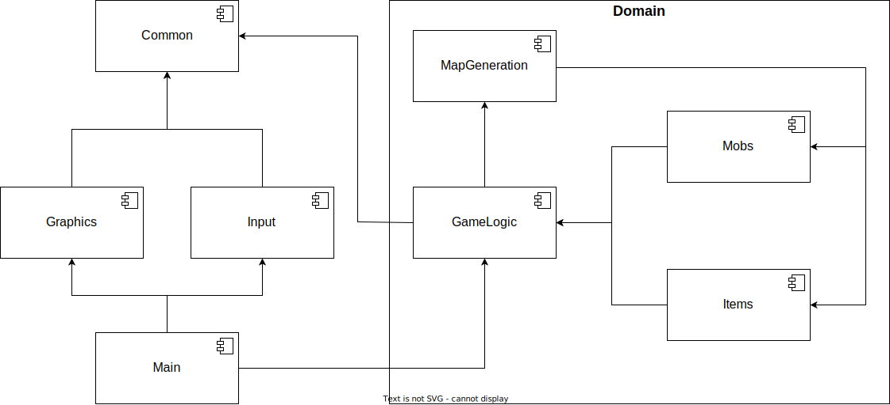

# Task 3 — Roguelike Architecture

## Команда
1. [Александр Плоскин](https://github.com/Alexander-Ploskin)
2. [Станислав Мищенко](https://github.com/mi-sts)

## Диаграмма компонентов

## Описание

Компонент **Main** является точкой входа в приложение, инициализирует и связывает между собой компоненты **Graphics**, **Input** и **GameLogic**. **Graphics** отвечает за рендеринг игровой графики в консоли. **Input** содержит методы обработки пользовательского ввода. **GameLogic** вкючает в себя основные правила игры и управляет взаимодействием между объектами игрового мира. **MapGeneration** служит для генерации игровой карты случайным образом или ее загрузкой из файла, а также созданием и размещением на ней предметов и мобов. Компонент **Mobs** описывает мобов и определяет логику их поведения. Компонент **Items** содержит классы, описывающие предметы игрового мира. Компонент **Common** содержит интерфейсы для взаимодействия классов предметной области с классами, отвечающими за взаимодействие с пользователем.

## Диаграмма классов

## Описание

### Input

Для реализации пользовательского ввода используется шаблон «Команда». Пользовательские события обрабатываются соответствующими командами в классе **Input** после их извлечения из очереди сообщений **MessageQueue** на очередном срабатывании игрового таймера.

### GameLogic

Фасадом для взаимодействия команд, отвечающих на пользовательские действия, и метода обработки срабатываний таймера служит класс **GameProcessFacade**. Также он взаимодействует с компонентом **MapGeneration** для инициализации игровой карты. Класс **GameProcess** отвечает за обновление игрового мира при срабатывании таймера. Абстрактный класс **GameObject** представляет собой игровой объект, содержащий информацию о своем положении в игровом мире, представленной классом **Transform**, и использующий класс **SpriteRender** для вывода своего отображения, представленного классом **Sprite** на экран. Метод **tick**, вызываемый при срабатывании таймера, определяется каждым конкретным наследником **GameObject** для реализации его поведения. Класс **Character** описывает игрового персонажа, предоставляет интерфейс для перемещения и атаки. Его игровые характеристики рассчитываются с учетом инвентаря, представленного классом **Inventory** и текущего уровня, представленного классом **Level**. Для определения результатов сражений используется класс **BattleCalculator**. Характеристики участника схватки агрегированы в струтуре **UnitStats**.  Класс **Map** хранит и предоставляет доступ к объектам игрового мира и их позициям.

### MapGeneration

Класс **MapGenerator** выполняет парсинг аргументов, полученных при запуске игры, и на их основе либо случайно генерирует карту, используя класс **RandomGenerator**, либо загружает ее из файла, используя класс **FileGenerator**. Создание различных типов мобов и предметов игрового мира реализуется при помощи шаблона «Абстрактная фабрика» и «Фабрика» соответственно. 

### Mobs

Абстрактный класс **Mob** является наследником **GameObject**, его наследники определяют необходимые методы для реализации поведения конкретных типов мобов. Для переключения поведения мобов во время игры используется шаблон «Состояние». Конкретный тип моба определяет классы-наследники интерфейса **MobBehavior** для реализации поведения в трех различных состояниях (агрессивном, трусливом и пассивном). Метод ***behave*** определяет действия моба на очередном шаге на основе состояния карты и здоровья моба и актуализирует состояние моба.